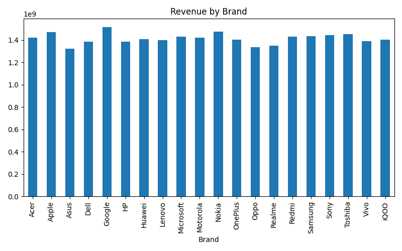
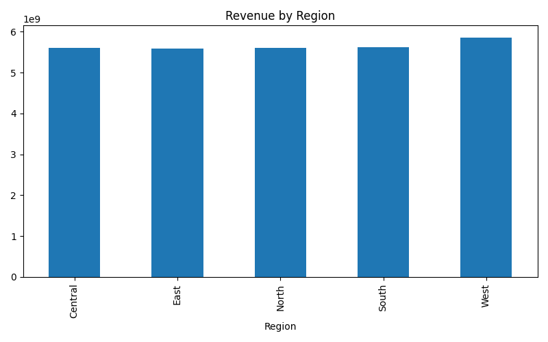
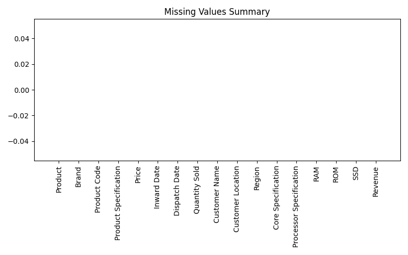

# Data Cleaning & Reporting Automation

## Project Overview

This project focuses on automating data cleaning and reporting workflows using Python. The objective is to improve data quality by handling missing values, removing duplicate records, and generating automated reports and visual summaries.

This project was developed as part of a Data Analytics Internship to demonstrate data preprocessing, automation, and reporting efficiency.

---

## Objective

- Automate data cleaning processes
- Handle missing values and duplicate records
- Generate cleaned datasets automatically
- Create automated reports
- Produce visual summaries for business insights

---

## Dataset Information

The project uses a Mobile Sales Dataset containing:

- Product Information
- Brand Details
- Product Specifications
- Sales Price
- Quantity Sold
- Customer Information
- Regional Data
- Hardware Specifications

---

## Technologies Used

- Python
- Pandas
- Matplotlib
- VS Code

---

## Project Workflow

### 1. Data Loading
Loaded the sales dataset using Pandas.

### 2. Data Cleaning
Performed automated data preprocessing by:

- Detecting missing values
- Filling missing values
- Identifying duplicate records
- Removing duplicate entries

### 3. Data Quality Assessment
Generated a data quality report containing:

- Total records
- Missing values count
- Duplicate records removed
- Dataset summary

### 4. Revenue Calculation
Created a Revenue column using:

Revenue = Price × Quantity Sold

### 5. Automated Reporting
Generated a text-based report automatically.

### 6. Visualization
Created automated visual summaries including:

- Revenue by Brand
- Revenue by Region
- Missing Values Summary

### 7. Export Process
Saved the cleaned dataset for future analysis.

---

## Generated Outputs

### Cleaned Dataset
```text
cleaned_sales_data.csv
```

### Data Quality Report
```text
data_quality_report.txt
```

### Visual Reports
```text
revenue_by_brand.png
revenue_by_region.png
missing_values.png
```

---

## Screenshots

### Revenue by Brand



### Revenue by Region



### Missing Values Summary



---

## Key Features

- Automated data cleaning
- Missing value handling
- Duplicate removal
- Automated report generation
- Revenue analysis
- Visual business summaries
- Clean dataset export

---

## How to Run

Install dependencies:

```bash
pip install -r requirements.txt
```

Run the automation script:

```bash
python automation_report.py
```

---

## Expected Outcome

The project demonstrates how data cleaning and reporting tasks can be automated using Python. It improves data quality, reduces manual effort, and generates actionable insights through automated reporting and visualization.

---

## Conclusion

This project successfully automates the data preprocessing and reporting workflow. By handling missing values, removing duplicates, generating reports, and creating visual summaries, it showcases practical data engineering and analytics skills used in real-world business environments.